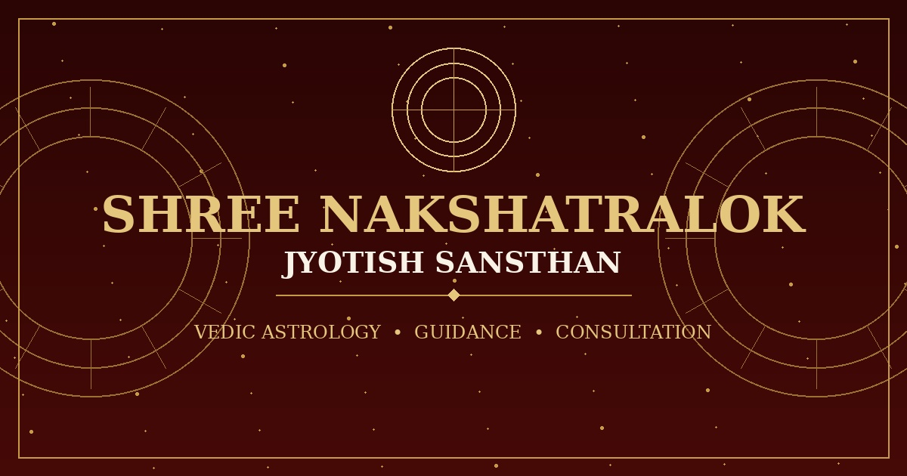

# ✦ श्री नक्षत्रलोक ज्योतिष संस्थान
### Shree Nakshatralok Jyotish Sansthan · Muzaffarnagar (U.P.)

<p align="center">
  
</p>

<p align="center">
  <strong>सत्य · सेवा · विश्वास</strong><br />
  <em>A Full-Stack Vedic Astrology, Daily Panchang & Ayurvedic Editorial Platform</em>
</p>

<p align="center">
  <a href="#-overview">Overview</a> •
  <a href="#-features">Features</a> •
  <a href="#-daily-vedic-panchang">Daily Panchang</a> •
  <a href="#-editorial-blog-cms">Blog CMS</a> •
  <a href="#-tech-stack">Tech Stack</a> •
  <a href="#-project-structure">Structure</a> •
  <a href="#-admin-dashboard">Admin Panel</a>
</p>

---

## 🌟 Overview

**Shree Nakshatralok Jyotish Sansthan** is a modern, full-stack digital sanctuary for traditional Indian Vedic Astrology, Daily Panchangam, and Ayurvedic wisdom. Led by senior Vedic astrologer **Pt. Radhey Shyam Sharma** (with over 55 years of unbroken Vedic scholarship in Muzaffarnagar, Uttar Pradesh), the platform bridges timeless Indian celestial sciences with modern web performance and editorial elegance.

The platform provides:
1. **Interactive Public Portal**: Heritage-grade user experience with bespoke Sanskrit typography, authentic Vedic iconography, and responsive layouts.
2. **Automated Daily Vedic Panchangam**: Real-time astrological ephemeris covering Tithi, Nakshatra, Yoga, Karana, Abhijit Muhurat, Rahukaal, and solar/lunar transitions.
3. **Astrology & Ayurveda Editorial Hub**: High-readability publication with rich text formatting, categories, and automated reading time calculations.
4. **Direct Astrologer WhatsApp Consultation**: Topic-routed one-tap consultation links for specific queries (Marriage, Career, Graha Shanti, Vastu, Gemstones).
5. **Secure Administrative CMS**: Protected dashboard for managing consultation leads, publishing daily panchang, and editing articles with MongoDB persistence.

---

## 🏛️ Core Features

### 1. 📅 Daily Vedic Panchangam (सम्पूर्ण दैनिक पञ्चाङ्ग दर्पण)
* **Dedicated Route (`/panchang`) & Home Highlight**:
  * **Interactive Date Navigation**: Browse past, present, and future dates with previous/next jumpers and custom calendar date selection.
  * **Pancha-Anga (पाँच अंग)**: Clear, dignified display of Tithi (तिथि व पक्ष), Nakshatra (नक्षत्र), Vaar (वार), Yoga (योग), and Karana (करण).
  * **Astronomical Precision**: Sunrise (सूर्योदय), Sunset (सूर्यास्त), Moonrise (चन्द्रोदय), and Moonset (चन्द्रास्त) tuned to Indian Standard Time (IST · UTC+5:30).
  * **Muhurat & Kaal Consideration**:
    * **शुभ काल**: Abhijit Muhurat (अभिजीत मुहूर्त), Brahma Muhurat (ब्रह्म मुहूर्त), and Amrit Choghadiya.
    * **वर्ज्य काल**: Rahukaal (राहुकाल), Yamaganda (यमगण्ड), and Gulika Kaal (गुलिक काल).
  * **Planetary & Transit Ledger**: Vikram Samvat, Shaka Samvat, Ayana (उत्तरायण/दक्षिणायन), Ritu (ऋतु), Sun Sign, and Moon Sign.
  * **Festival & Vrat Highlights**: Prominent alert for active Ekadashi, Pradosh, Purnima, Amavasya, or seasonal festivals.
  * **SEO & JSON-LD**: Automatic `WebPage` structured schema for search engines.

### 2. 📜 Astrology & Ayurveda Blog CMS (ज्ञान एवं आलेख संग्रह)
* **Public Hub (`/blog`) & Single Article (`/blog/[slug]`)**:
  * **Editorial Category Navigation**: Filter by Vedic Astrology, Ayurveda, Kundali Milan, Graha Dosh, Vastu, or Spirituality.
  * **Instant Search**: Real-time filtering by title, excerpt, and category.
  * **Magazine-Grade Reading Experience**:
    * Curated 16:10 / 16:9 photographic aspect ratios.
    * Sanskrit drop-caps, gold-accented blockquotes for sacred shlokas, and styled remedy callout boxes.
    * Astrologer author bio card and social share buttons (WhatsApp, Facebook, Twitter, Link Copy).
  * **Automated Word Count & Reading Time**: Calculated on save and displayed in Devanagari numerals.
  * **Full Schema.org `BlogPosting` markup** with OpenGraph previews.

### 3. 💬 Direct Astrologer Communication (प्रत्यक्ष संवाद)
* **Topic-Routed WhatsApp Consultation**:
  * Quick pre-filled WhatsApp inquiry buttons for:
    * ☽ विवाह एवं कुंडली मिलान (Marriage & Compatibility)
    * ☉ करियर, नौकरी एवं व्यापार (Career & Business Growth)
    * ♄ शनि साढ़ेसाती व ग्रह दोष शांति (Planetary Afflictions & Remedies)
    * ⌂ वास्तु दोष एवं गृह शांति (Vastu Shastra & Home Peace)
    * ◇ रत्न परामर्श एवं धारण विधि (Gemstone Recommendations)
    * ✦ तात्कालिक व्यक्तिगत प्रश्न (Urgent Personal Queries)
* **Direct Telephonic Consultation**: Direct tap-to-call link for offline consultation.
* **Refined Floating WhatsApp Button**: Official SVG icon with subtle gold trim.

### 4. 🔮 Comprehensive Astrology Services
Dedicated landing pages with structured layouts for 10+ Vedic disciplines:
* [Vedic Astrology Consultation](app/services/vedic-astrology/page.tsx)
* [Janam Kundli Creation & Analysis](app/services/janam-kundli/page.tsx)
* [Kundali Milan & Matchmaking](app/services/kundali-milan/page.tsx)
* [Muhurat & Namkaran Ceremony](app/services/muhurat-namkaran/page.tsx)
* [Graha Dosh & Shanti Puja](app/services/graha-dosh/page.tsx)
* [Vastu Shastra Consultation](app/services/vastu/page.tsx)
* [Gemstone & Rudraksha Guidance](app/services/gemstone-consultation/page.tsx)
* [Medical & Health Astrology](app/services/medical-astrology/page.tsx)
* [Palmistry (Hastarekha)](app/services/palmistry/page.tsx)
* [Tarot Reading & Numerology](app/services/tarot-reading/page.tsx)

### 5. 🛡️ Secure Admin Control Center (`/admin`)
* **Consultation CRM**:
  * Ingests visitor birth details (Name, DOB, TOB, POB, Question, Phone).
  * Lead pipeline: `NEW` ➔ `CONTACTED` ➔ `COMPLETED`.
  * Real-time search, status toggles, deletion, and one-click CSV export.
* **Panchang Management CMS (`/admin/panchang`)**:
  * Create, edit, and publish daily Panchang records with automated IST date defaults.
* **Blog Post Editor CMS (`/admin/blog`)**:
  * Rich HTML editor, slug generator, custom SEO meta tags (title, description, keywords, canonical URL), and status management (`DRAFT` vs `PUBLISHED`).
* **Protected by NextAuth.js** with encrypted session handling.

---

## 🛠️ Technology Stack

| Layer | Technologies |
|---|---|
| **Framework** | [Next.js 16](https://nextjs.org/) (App Router, Server Components, Turbopack) |
| **Language** | [TypeScript](https://www.typescriptlang.org/) (Strict typing, zero lint errors) |
| **Database** | [MongoDB](https://www.mongodb.com/) via [Prisma ORM](https://www.prisma.io/) |
| **Authentication** | [NextAuth.js v4](https://next-auth.js.org/) (Credentials provider) |
| **Styling** | Vanilla CSS Design System + Tailwind CSS v4 |
| **Typography** | Google Fonts: `Cinzel`, `Cormorant Garamond`, `Inter` |
| **Email Delivery** | [Nodemailer](https://nodemailer.com/) (Instant lead dispatch) |
| **Security** | [DOMPurify](https://github.com/cure53/DOMPurify) & [jsdom](https://github.com/jsdom/jsdom) HTML sanitization |

---

## 📁 Project Structure

```text
shree-nakshatralok/
├── app/
│   ├── (auth)/admin/login/         # Admin authentication login
│   ├── admin/                      # Protected Admin Dashboard
│   │   ├── blog/                   # Blog Post CMS (create, edit, publish)
│   │   ├── panchang/               # Daily Panchang CMS
│   │   └── page.tsx                # Lead inquiries CRM
│   ├── api/                        # REST endpoints (contact, admin, auth, export)
│   ├── blog/                       # Public Blog index & [slug] dynamic pages
│   ├── panchang/                   # Public Daily Panchangam page
│   ├── services/                   # Individual Vedic astrology service pages
│   ├── styles/                     # Modular design stylesheets
│   │   ├── panchang.css            # Vedic Patrika & Panchang typography
│   │   ├── blog.css                # Magazine editorial layout & typography
│   │   ├── talk-astrologer.css     # Direct WhatsApp consultation section
│   │   ├── floating-whatsapp.css   # Floating contact widget
│   │   └── ...                     # Section stylesheets
│   ├── globals.css                 # CSS variables, tokens, and imports
│   ├── layout.tsx                  # Root layout with Google font variables
│   ├── page.tsx                    # Main homepage
│   ├── robots.ts                   # Search engine crawler policies
│   └── sitemap.ts                  # Dynamic XML sitemap
├── components/
│   ├── admin/                      # Admin UI, tables, and CMS forms
│   ├── blog/                       # Public blog lists, share buttons
│   ├── home/                       # Home Panchang and Blog highlight sections
│   ├── panchang/                   # PanchangViewClient & bespoke SVG glyphs
│   ├── public/                     # PublicHeader and PublicFooter
│   └── TalkToAstrologerSection.tsx # WhatsApp Astrologer showcase
├── lib/
│   ├── date.ts                     # Hindi date formatting utilities
│   ├── prisma.ts                   # Global Prisma client singleton
│   ├── sanitize.ts                 # Server-side HTML sanitizer
│   └── site.ts                     # Centralized site configurations
├── prisma/
│   └── schema.prisma               # MongoDB database schemas
└── public/                         # Optimized imagery and icons
```

---

## 🛡️ Administrative Access

To access the administrative dashboard:
1. Navigate to `http://localhost:3000/admin/login`
2. Authenticate using `ADMIN_EMAIL` and `ADMIN_PASSWORD`
3. Manage consultations, author articles, or publish daily panchang entries.

---

## 📜 License

Created with devotion for **Shree Nakshatralok Jyotish Sansthan** by **Kartik Vashishtha**.  
All rights reserved © 2026.